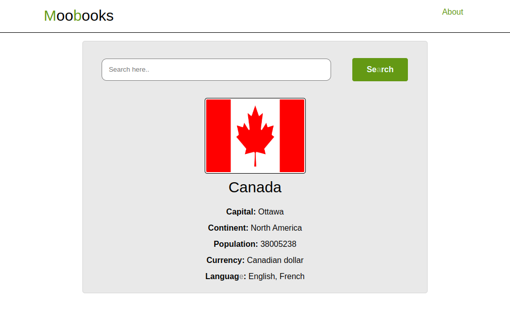

# Practice: Browser for countries

This small project is part of my learning path to become a web developer. At this stage I'm learning the basic technologies of this area of programming.

## Topics:

- Regular expressions
- Asynchronous javascript
- Data from API

This game is built with pure JS, taking inspiration and ideas from an online tutorial and adding my own functionalities.

You will be able to **search** a country by his name. What you will see will be the first option that most closely matches your search criteria.

You will be shown information such as: **capital city**,**continent**,**population**,**currency** and **language**.

## View

## Technologies

    - HTML
    - CSS
    - JS
